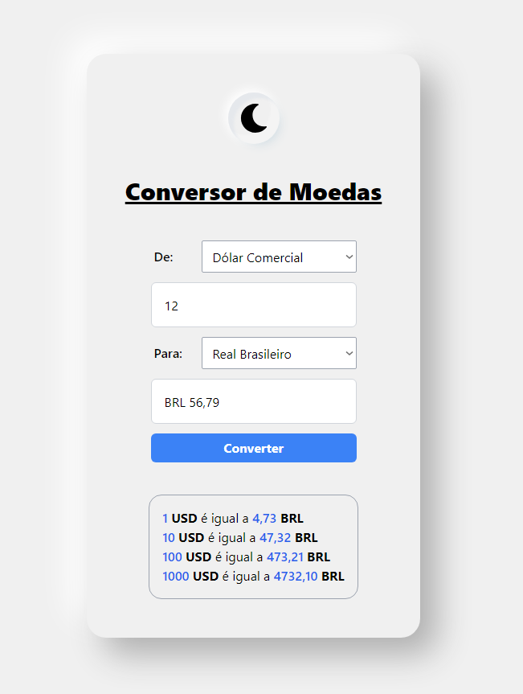
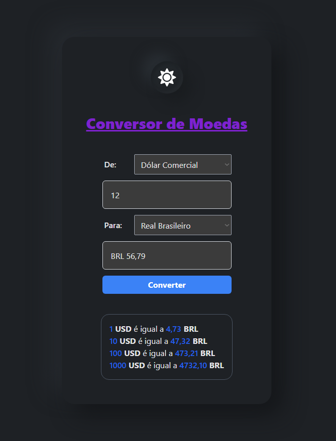

## Conversão de Moeda

## Resumo 

 - Aplicação para câmbio de moedas e valores consumindo a AwesomeAPI.

## API

 - AwesomeAPI
 - Link:
  - https://docs.awesomeapi.com.br/api-de-moedas

## Tecnologias 

 - React
  - React Hooks
 - TypeScript
  - Requisição Fetch
 - TailwindCSS
  - TwMerge
  - tailwind/nesting
 - Next.js
  - next-themes

## Link do Site

 - Vercel
  - [Exchange API](https://exchange-api-reactjs.vercel.app)

## Screenshots

# Light Mode
                                   Light Mode        
   

# Dark Mode
                                   Dark Mode
   
